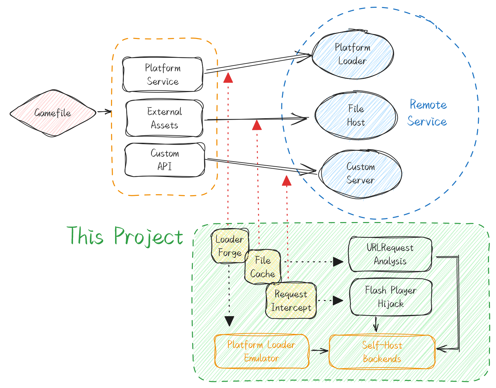

# 4399 的 Flash RPG 小游戏本地化研究

Make 4399 Flash RPG Fun Again!

## Prologue
在 Flash Player 2020 年 12 月 31 日停止更新之后，Flash Player 将不再提供安全更新，Adobe 将不再为 Flash Player 提供技术支持。这被视为 Flash 游戏走向终结的开始。但是，由于 Flash 游戏的历史悠久，现今仍有许多 Flash 游戏仍在运营，也仍有许多 Flash 游戏玩家正在坚持，但在浏览器中运行 Flash 却问题重重。

首先，国内特供版的 Flash 插件已沦为广告与恶意软件的代名词，完全无法使用。

其次，虽然 Ruffle 的出现为 Flash 游戏的未来带来了希望，但是它仍然处于早期阶段，无法完全兼容所有 Flash 游戏。事实上，Ruffle 甚至无法在 4399 上运行任何一个 2013 年后发布的“新”游戏。

最后，即使使用了干净的 Flash 插件，4399 小游戏内在的付费、登录、广告等在在线游玩问题也无法解决。因此，本文将以 2024 年的后启示录视角，分析当下 Flash 游戏去网络化所遇到的挑战，并希望一般玩家也能实现游戏自由。

_去网络化_ 指的是将需要网页游玩的 Flash 游戏，转化为单机可玩的游戏。

## Fugue
Flash 游戏的保护，如同其他所有脚本语言一样，主要分为在客户端层对 SWF 格式的修改与加壳，以及在服务器层面进行通信协议混淆与鉴权。

Flash 的闭源，且运行时统一提供，导致了 SWF 文件难以进行 anti-decompile，强大的 Flash 混淆器较少，能被游戏提供商使用的则更少。诚然 Ruffle 的出现有机会改变这一情况，但至少现在无需担心。所以，目前客户端能做的事情，就基本只有对 SWF 文件进行基本加壳而已。

加壳后的原始文件存储位置一般分为内嵌（Embed）与云端两种，而这两者都可以内存转储或请求截取的方式解决。对于某些特定的加密方法，我们在这里不会讨论。

我们的目的如下：
1. 使游戏单机可玩
2. 使游戏仅需要 Ruffle 或本机 Flash Player Projector

遇到的问题有：
1. Flash Player Projector Security Policy 导致外部资源访问问题
2. 游戏依赖 4399 装载器提供的平台 API
3. 游戏文件动态加载使得无法全量备份
4. 游戏依赖非平台 API

## Ternary
对于 #1，我们可以通过修改 Flash Player Projector 的安全策略文件来解决。参考 https://stackoverflow.com/questions/3914389/change-flash-security-whilst-offline

对于 #2，我们可以创建一个本地的 Loader Emulator。

对于 #3，我们需要进行关于外部请求的动、静态分析，对各个游戏作针对性的处理。

对于 #4，我们需要自建后端，并模拟通信协议。

## Coda
TODO

